# Transformer的手动实现讲解
<div align="center">
  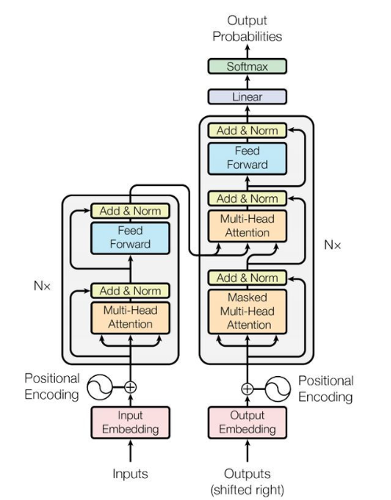
  <p>图1-Transfomer结构图</p>
</div>

上图是 Transformer 的内部结构图，左侧为 Encoder block，右侧为 Decoder block：
- 圈中的Multi-Head Attention（多头注意力），是由多个Self-Attention（自注意力）组成的。其中Encoder block 包含一个 Multi-Head Attention，而 Decoder block 包含两个 Multi-Head Attention (一个Masked，一个没有)。  
- Add & Norm 层，Add 表示残差连接 (Residual Connection) 用于防止网络退化，Norm 表示 Layer Normalization，用于对每一层的激活值进行归一化。
- Feed Forward 层是一个两层的全连接层，第一层的激活函数为 Relu，第二层不使用激活函数。
## 1.Transformer工作流程
**step-1:**获取输入的句子的每个单词表示向量**X**（由<u>单词的Embedding与单词位置的Embedding相加</u>得到）。
<div align="center">
  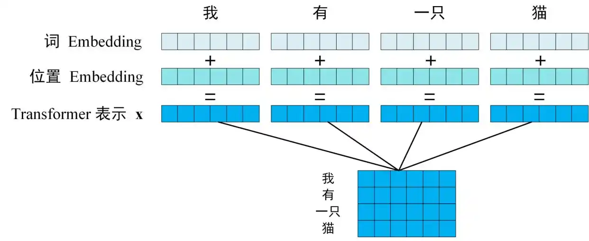
  <p>图2-Transfomer的输入表示向量</p>
</div>  

最终得到的**X**，每一行是一个词，每一行的Embedding维度为d。对于n个词的序列，最终得到的表示向量形成的矩阵**X<sub>n×d</sub>**

**step-2:X<sub>n×d</sub>**传入**Encoder**中,经过n个Encoder Block后输出得到一个编码矩阵**C<sub>n×d</sub>**

<div align="center">
  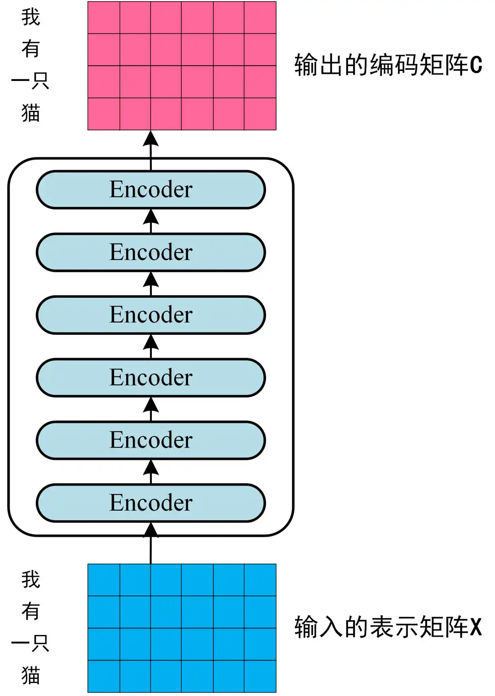
  <p>图3-Transformer-Encoder编码句子信息.png</p>
</div> 

**step-3:编码矩阵**C<sub>n×d</sub>**传递到 Decoder （n个Decoder Block）中，后输出预测的序列。

<div align="center">
  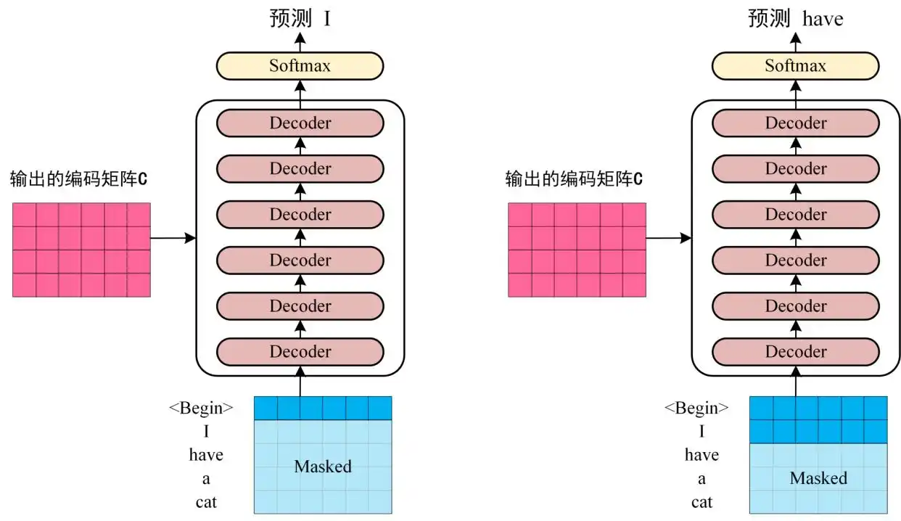
  <p>图4-Transformer-Decoder预测</p>
</div> 

Decoder依次根据当前翻译过的单词前第1到第i个单词，翻译第i+1个单词（即mask掉第i+1之后的所有词）。
首先输入翻译开始符 "<Begin>"，开始预测第一个单词 "I"；然后输入翻译开始符 "<Begin>" 和单词 "I"，预测单词 "have"，以此类推。

# 各部分细讲
## 2.Transformer输入
输入表示矩阵X：由单词Embedding和位置Embedding组成，单词Embedding可以使用预训练模型，也可使用transformer训练得到。
而**位置Embedding** 由下面的公式计算得到： 
$$
PE_{(pos,2i)} = \sin\left( \frac{pos}{10000^{2i/d}} \right)
$$

$$
PE_{(pos,2i+1)} = \cos\left( \frac{pos}{10000^{2i/d}} \right)
$$
公式中pos为单词的位置，d为**PE**的维度（与单词Embedding保持一致），2i表示偶数维度，2i+1表示奇数维度。  
最后再将此处的PE与前面单词Embedding合起来即可得到向量化后的输入矩阵**X<sub>n×d</sub>**。涉及代码如下：
```python
'''位置信息编码模块：为输入序列添加位置信息'''
class PositionalEncoding(Module):
    """d_model: 词嵌入维度（也就是序列每个单元需要多少维度表示），max_len: 支持的最大序列长度"""
    def __init__(self, d_model, dropout=0.1, max_len=5000):
        # 继承torch.nn.Modlue类的基础方法
        # torch.nn.Modlue类： PyTorch 中所有神经网络模块的基类，
        # 所有神经网络组件（比如层、参数、计算步骤）都是它或它的子类
        super().__init__()

        # pe:编码矩阵初始化
        pe = torch.zeros(max_len, d_model)

        # 生成位置索引position.shape(max_len,1)
        position = torch.arange(0, max_len, dtype=torch.float).unsqueeze(1)
        # 计算频率项
        div_term = torch.exp(
            torch.arange(0,d_model,2,dtype=torch.float)
            *(math.log(10000)/-d_model))
        # 偶数位置索引
        pe[:,::2] = torch.sin(position*div_term)
        # 奇数位置索引
        pe[:,1::2] = torch.cos(position*div_term)

        # 增加batch维度，便于训练pe.shape(1,max_len,d_model)
        pe = pe.unsqueeze(0)

        # 将位置编码矩阵注册为buffer（不会被训练，但会保存到模型参数中）
        # 该方法将张量注册为模块的缓冲区，使得张量成为模块的一部分，并在模块保存和加载时被处理。
        self.register_buffer('pe', pe)

    def forward(self, x):
        # x.shape(batch_size,seq_len,d_model)
        # pe只取前seq_len个，降低计算成本
        # self.pe[:, :x.size(1)].shape(1,seq_len,d_model)
        x = x + self.pe[:, :x.size(1)]
```
代码中`div_term`即为计算公式的分母项，结合如下公式可以理解上述代码中的中`div_term`计算方法：
$$
\frac{1}{10000^{2i/d_{\text{model}}}} = \exp\left( -\frac{2i \cdot \ln(10000)}{d_{\text{model}}} \right)
$$

## 3.Self-Attention
### 3.1 Self-Attention 的结构
<div align="center">
  
  <p>图5-Self-Attention结构</p>
</div> 
Self-Attention的输入是X<sub>n×d</sub>或上一个Encoder Block的输出（形状也是n×d），
其中Q, K, V 是通过 Self-Attention 的输入进行线性变换得到。

### 3.2 Q,K,V 的计算
假设输入Self-Attention的是矩阵X<sub>n×d</sub>，针对Q, K, V 的线性变换矩阵分别为 WQ, WK, WV 。
<div align="center">
  
  <p>图6-Q, K, V 的计算</p>
</div> 

计算过程可以通过如下所示代码进行功能实现（此处代码只是计算的参考，不符合真实代码语法要求）
```python
# 线性变换矩阵Q、K、V
self.W_q = nn.Linear(d_model, d_model)
self.W_k = nn.Linear(d_model, d_model)
self.W_v = nn.Linear(d_model, d_model)
self.W_o = nn.Linear(d_model, d_model)
"""线性变换层"""
def linear_transform(self,x,linear_layer):
    return linear_layer(x)
# 对查询、键、值进行线性变换
q = self.linear_transform(x, self.W_q)
k = self.linear_transform(x, self.W_k)
v = self.linear_transform(x, self.W_v)
```

### 3.3 Self-Attention 的输出【重点】
通过计算得到的Q, K, V 可以计算Self-Attention 的输出，
$$
\text{Attention}(Q, K, V) = \text{softmax}\left( \frac{QK^T}{\sqrt{d_k}} \right)V
$$
参数说明 
- **查询矩阵**：$Q \in \mathbb{R}^{n \times d_k}$
- **键矩阵**：$K \in \mathbb{R}^{m \times d_k}$ 
- **值矩阵**：$V \in \mathbb{R}^{m \times d_v}$ 
- **缩放因子**：$\sqrt{d_k}$ 用于控制点积数值范围（防止梯度消失）

${QK^T}$的计算，过程如下所示：
<div align="center">
  
  <p>图7-QK^T的计算</p>
</div>  

${QK^T}$经过$\sqrt{d_k}$缩小后得到注意力分数矩阵，再通过${softmax}$操作得到每个单词之间的Attention系数，每一行的系数之和为1.
<div align="center">
  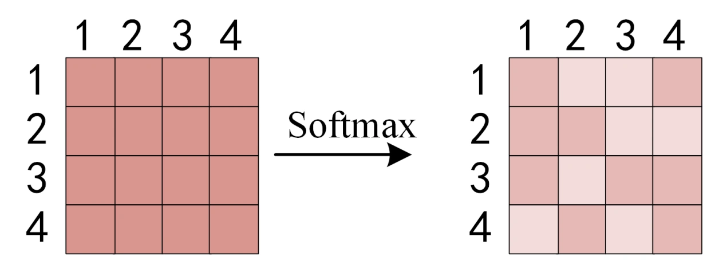
  <p>图8-Softmax</p>
</div>  

Softmax得到的矩阵再与矩阵V相乘可以得到，输出矩阵Z。
<div align="center">
  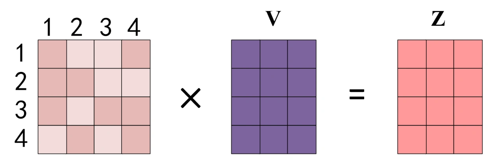
  <p>图9-Self-Attention输出</p>
</div>  

其中输出矩阵Z的每一行可以理解为，通过该单词的注意力分布（即softmax之后的注意力分数矩阵）
与整个序列（即矩阵V）的相乘，得到了**该单词与所有序列的关系**，其计算过程如下:
<div align="center">
  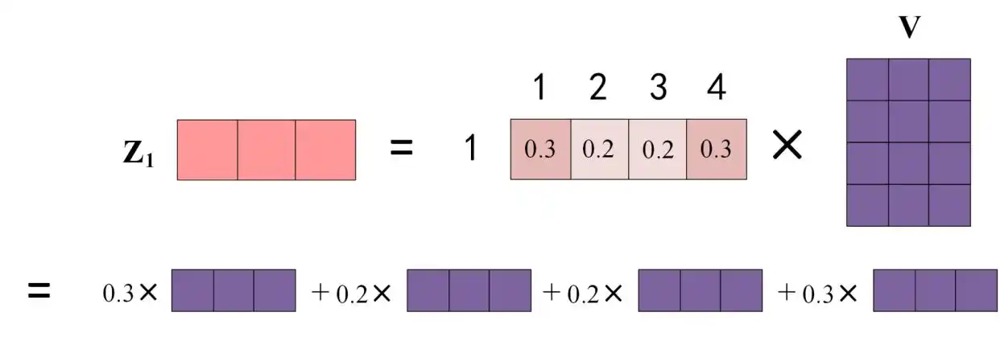
  <p>图10-Z1的计算方法</p>
</div>  

Self-Attention 的输出的计算代码如下：
```python
# 注意力分数
# # 把k的维度进行调转
# #（为什么是-1与-2，因为k.shape==(batch_size, h, seq_len, d_k)，后面有多头注意力与batch）
 attention_score = (q@k.transpose(-2, -1))/math.sqrt(self.d_k)
# 注意力权重
attention_weight = F.softmax(attention_score, dim=-1)
attention_weight = self.dropout(attention_weight)
# 输出(batch_size, h, seq_len, d_k)
output = attention_weight @ v
```
### 3.4Multi-Head Attention
Multi-Head Attention 是由多个 Self-Attention 组合形成的，下图为结构图：
<div align="center">
  
  <p>图11-Multi-Head Attention</p>
</div> 

注：单个Self-Attention叫Scaled Dot-Product Attention，是因为使用了点积与缩放。  
假设h=8，单个Self-Attention的输出分别为Z1~Z8，最终Multi-Head Attention 的输出：
<div align="center">
  
  <p>图12-Multi-Head Attention 的输出</p>
</div> 

```python
# 此处的d_k为单个Self-Attention的维度
self.d_k = d_model//h
self.h = h

"""将线性变换后的结果切分为多个头"""
def split_head(self,x,batch_size):
    # x.shape(batch_size, seq_len, d_model)
    # to (batch_size, seq_len,h, d_model)
    # 因为h*d_k=d_model,所以-1直接将原来还剩的维度存到第二维度
    x = x.view(batch_size, -1, self.h, self.d_k)
    # 将h维度转换到第二维度，便于后续将x(q\k\v)分给不同注意力头
    x = x.permute(0, 2, 1, 3)# 等价于x.transpose(1,2)
    return x

"""合并多个头的输出：调用前面单个Self-Attention 的输出，进行合并"""
def merge_head(self, x, batch_size):
    # from (batch_size, h, seq_len, d_k)
    # to (batch_size, seq_len, h, d_k)
    x = x.permute(0, 2, 1, 3)
    
    x = x.reshape(batch_size, -1, self.h*self.d_k)
    return x
```

Multi-Head Attention的意义：
: 1️⃣ 通过并行计算h个头，每个头学习不同的权重矩阵，关注序列的不同部分，在不同表示子空间联合关注信息，从而提高学习能力。
: 2️⃣ 过低秩矩阵压缩KV状态，降低计算开销，同时将高维空间分解成多个低维子空间，缓解维度灾难。
: 3️⃣ 通过划分到h个头，增强特征表达鲁棒性，并行计算提升训练速度，支持大规模GPU加速。

## 4.Encoder
### 4.1 Add&Norm
针对Multi-Head Attention的Add&Norm：
$$
\mathrm{LayerNorm}\Big( X + \mathrm{MultiHeadAttention}(X) \Big)
$$
针对前馈神经网络FeedForward的Add&Norm：
$$
\mathrm{LayerNorm}\Big( X + \mathrm{FeedForward}(X) \Big)
$$
**Add**是指X+MultiHeadAttention(X)，一种残差连接，通常用于解决多层网络训练的问题（避免神经网络层数越多越学越差），
可以让网络只关注当前差异的部分，源自于ResNet。
<div align="center">
  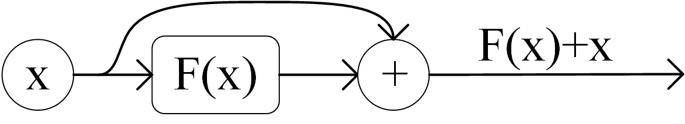
  <p>图13-残差连接</p>
</div> 

**Norm**指 Layer Normalization，将每一层神经元的输入都转成均值方差都一样的，加快收敛速度。

### 4.2 前馈神经网络FFN
Feed Forward是一个两层的全连接层，第一层的激活函数为 Relu，第二层不使用激活函数：
$$
\mathrm{FFN}(X) = \max\left(0, XW_1 + b_1\right)W_2 + b_2
$$
参数说明
- **输入矩阵**：$X \in \mathbb{R}^{n \times d_{\text{model}}}$ (n为序列长度，d为特征维度)
- **权重矩阵**：  
  - $W_1 \in \mathbb{R}^{d_{\text{model}} \times d_{\text{ff}}}$(升维矩阵，通常$d_{\text{ff}} = 2048$)
  - $W_2 \in \mathbb{R}^{d_{\text{ff}} \times d_{\text{model}}}$ (降维矩阵)
- **偏置项**：$b_1 \in \mathbb{R}^{d_{\text{ff}}}$, $b_2 \in \mathbb{R}^{d_{\text{model}}}$
- **激活函数**：ReLU ($\max(0, \cdot)$)
代码如下：
```python
'''FFN前馈神经网络'''
class FeedForward(Module):
    def __init__(self, d_model,d_ff=2048, dropout=0.1):
        super().__init__()
        # 两层：第一层扩展维度(非线性在激活函数实现)，第二层压缩回维度且组合第一层非线性
        self.linear1 = nn.Linear(d_model, d_ff)
        self.dropout = nn.Dropout(p=dropout)
        self.linear2 = nn.Linear(d_ff, d_model)
    """前向传播：Linear->ReLU->Dropout->Linear"""
    def forward(self, x):
        # (batch_size, seq_len, d_ff)
        x = self.linear1(x)
        # 非线性关系
        x = F.relu(x)
        x = self.dropout(x)
        # (batch_size, seq_len, d_ff)
        return self.linear2(x)
```
### 4.3Encoder的组装

[ Multi-Head Attention + Add&Norm + FFN + Add&Norm] * n，即组成了Encoder，
每个单独的被称为EncoderBlock/Layer,最后一个block输出的矩阵就是**编码信息矩阵C**，这一矩阵后续会用到 Decoder 中：
```python
'''EncoderBlock/Layer：Multi-Head Attention + FeedForward,每层后ADD&Norm'''
class EncoderLayer(Module):
    def  __init__(self, d_model, h, d_ff, dropout=0.1):
        super().__init__()
        self.self_att = MultiHeadAttention(d_model,h,dropout)
        self.ffn = FeedForward(d_model,d_ff,dropout)
        self.norm1 = nn.LayerNorm(d_model)
        self.norm2 = nn.LayerNorm(d_model)
        self.dropout1 = nn.Dropout(dropout)
        self.dropout2 = nn.Dropout(dropout)

    def forward(self, x, mask=None):
        # 自注意力的残差连接
        # self.self_att(x, x, x, mask)会自动调用MultiHeadAttention类的
        # forward方法。在PyTorch中，当你定义一个nn.Module类的实例
        # 并对其进行函数调用（即使用()）时，它会自动调用该类的forward方法
        x = x + self.dropout1(self.self_att(x, x, x, mask))
        x = self.norm1(x)

        # FFN的残差连接
        x = x + self.dropout2(self.ffn(x))
        return self.norm2(x)
    
'''EncoderBlock堆叠'''
class Encoder(Module):
    def __init__(self, num_layers,d_model,h,d_ff, dropout=0.1):
        super().__init__()
        # 创建num_layers个EncoderBlock
        self.layers = nn.ModuleList(
            [EncoderLayer(d_model,h,d_ff,dropout) for _ in range(num_layers)]
        )

    def forward(self, x, mask=None):
        for layer in self.layers:
            x = layer(x, mask)
        return x
```
设计的意义
: 1️⃣ 引入了非线性变换：第一层ReLU产生非线性，第二层对第一层的非线性进行线性组合，增强模型对复杂数据的表达
: 2️⃣ 通过维度变化关注更多特征属性维度【扩展-收缩】：第一层先将输入映射到更高维度（一般为d->4d），给模型更多
的空间表达特征，例如输入图像的边缘信息，扩展后可以考虑边缘的方向、强度等更多属性。
第二层再将维度压缩为原来的维度，即从大量特征属性中筛选出最有用的信息，并整合其为原有维度。

## 5.Decoder
<div align="center">
  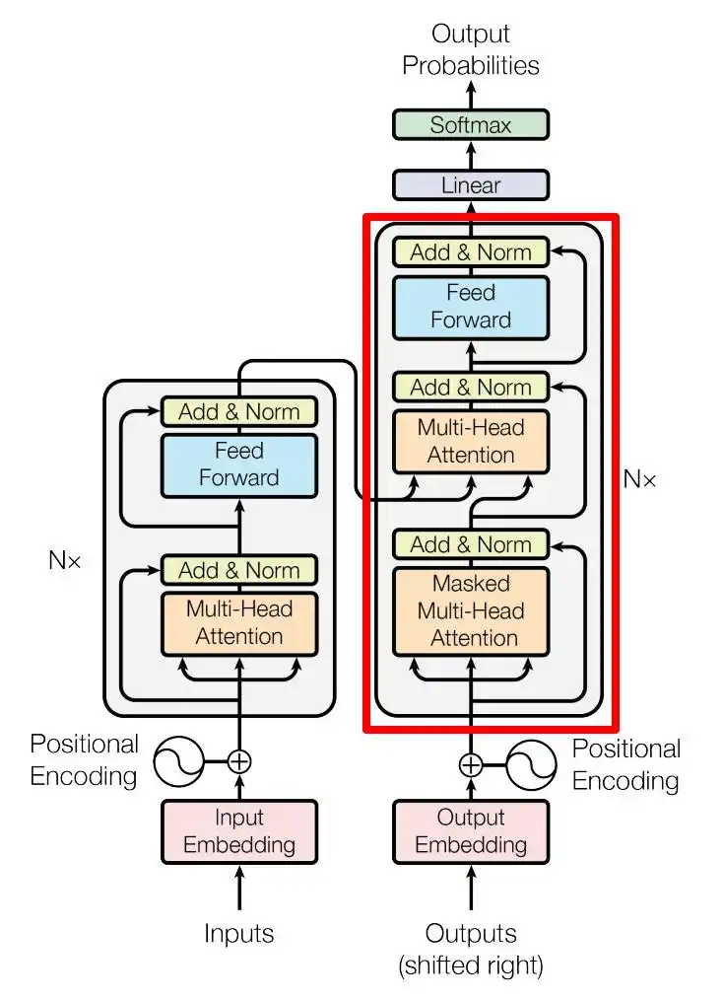
  <p>图14-Transformer Decoder block</p>
</div>  

### 5.1 Masked Multi-Head Attention
在 Decoder 的时候，是需要根据之前的翻译，求解当前最有可能的翻译，不能根据之后的信息预测后面的信息（训练的时候知道，但是实际应用预测的场景中并不知道）
所以，需要进行mask操作：现在在翻译第i个词，就遮住第i+1到最后的词，只能利用第1到第i-1个已经翻译好的信息。

下面用 0 1 2 3 4 5 分别表示 "<Begin> I have a cat <end>"，将其作为Decoder的输入。  
**step-1:** 生成Mask矩阵
<div align="center">
  
  <p>图15-输入矩阵与 Mask 矩阵</p>
</div>  

**step-2:** 生成QK^T矩阵（与之前不Mask的一样），可以在这里缩放也可以在mask之后缩放，但一定要在softmax之前缩放
<div align="center">
  
  <p>图16-QK^T矩阵</p>
</div>  

**step-3:** 将QK^T矩阵进行Mask操作**按位相乘**，生成Mask QK^T（保证注意力分数不能涵盖当前没出现的词），再softmax
<div align="center">
  
  <p>图17-Mask-QK%5ET</p>
</div>  

剩下的步骤与之前相同

**step-4:** 使用 Mask QKT 与矩阵 V相乘，得到输出 Z，则单词 1 的输出向量 Z1 是只包含单词 1 信息的。

**step-5:** 通过上述步骤就可以得到一个 Mask Self-Attention 的输出矩阵 Zi，然后和 Encoder 类似，通过 Multi-Head Attention 拼接多个输出 Zi 然后计算得到第一个 Multi-Head Attention 的输出 Z，Z与输入 X 维度一样。
```python
"""计算缩放点积注意力(默认不mask)"""    
    def scaled_dot_attn(self,q,k,v,mask=None):
        # q\k\v.shape (batch_size, h, seq_len, d_k)
        # mask.shape (batch_size, h, seq_len, seq_len)
        # q与k^T相乘后缩小sqrt(d_k)得到
        # 注意力分数矩阵(batch_size, h, seq_len, seq_len)
        attention_score = (q@k.transpose(-2, -1))/math.sqrt(self.d_k)

        # 掩码的应用
        if mask is not None:
            # mask==0，得到bool矩阵，True位置对应需要mask的，False位置对应不mask
            # attention_score进行mask：
            # bool矩阵中True 的位置值替换为 -1e9，False保持不变
            attention_score = attention_score.masked_fill(mask == 0, -1e9)

        # 注意力权重
        attention_weight = F.softmax(attention_score, dim=-1)
        attention_weight = self.dropout(attention_weight)

        # 输出(batch_size, h, seq_len, d_k)
        output = attention_weight @ v
        return output, attention_weight
    
"""生成掩码：假设为了保证数据整齐，使用了padding，所以输入序列也需要掩码"""    
def generate_mask(src,tgt,pad_idx=0):
    # 屏蔽padding部分
    ## 假设输入序列 src = [[1, 2, 0]]（pad_idx=0）
    ## src_mask = [[[[True, True, False]]]]  # 屏蔽第三个位置（填充）
    src_mask = (src != pad_idx).unsqueeze(1).unsqueeze(2) # (batch_size, 1, 1, src_len)

    # 屏蔽padding部分,假设目标序列 tgt = [[3, 4, 0]],pad_idx=0
    ## src_mask = [[[[True, True, False]]]]  # 屏蔽第三个位置（填充）
    tgt_mask = (tgt != pad_idx).unsqueeze(1).unsqueeze(2)
    # 上三角掩码
    # # triu_mask = [[[[True, False, False],
    #                 [True, True, False],
    #                 [True, True, True]]]]  # 未来信息掩码
    seq_len = tgt.size(1)
    # diagonal=0对角线为与上三角保留；1，不含对角线为的上三角保留
    # 然后1-原来的矩阵再反转
    trid_mask = (1-torch.triu(torch.ones(1,seq_len, seq_len), diagonal=1)).bool()
    # merged_tgt_mask = [[[[True, False, False],
    #                      [True, True, False],
    #                      [True, True, False]]]]  # 合并后的掩码
    tgt_mask = tgt_mask & trid_mask.to(tgt.device)

    return src_mask, tgt_mask
```

### 5.2 Multi-Head Attention (第二个)
此处的Multi-Head Attention采用了交叉注意力机制（Cross-Attention），整体与Encoder的一致，只是Q,K,V 的计算方式有所不同.  
- Q：上一个Decoder Block的输出矩阵Z线性变换得到（如果是第一个block，则使用第一个Masked Multi-Head Attention的输出）
- K与V：使用Encoder的输出信息编码矩阵C线性变换得到
$$
\mathrm{CrossAttention}(Q=Z,\, K=C,\, V=C) = \mathrm{softmax}\left( \frac{ZC^\top}{\sqrt{d_k}} \right) C
$$

**交叉注意力机制的意义：通过分离（Q） 与 键（K）、值（V）的来源，在输入序列与目标之间建立动态关联**

### 5.3 Softmax输出预测单词
通过之前的网络层我们可以得到一个最终的输出 Z，之后再通过一个Linear层进行线性变化（d_model->tgt_vocab_size）
,然后再利用进行一次Softmax，最终输出预测单词。
<div align="center">
  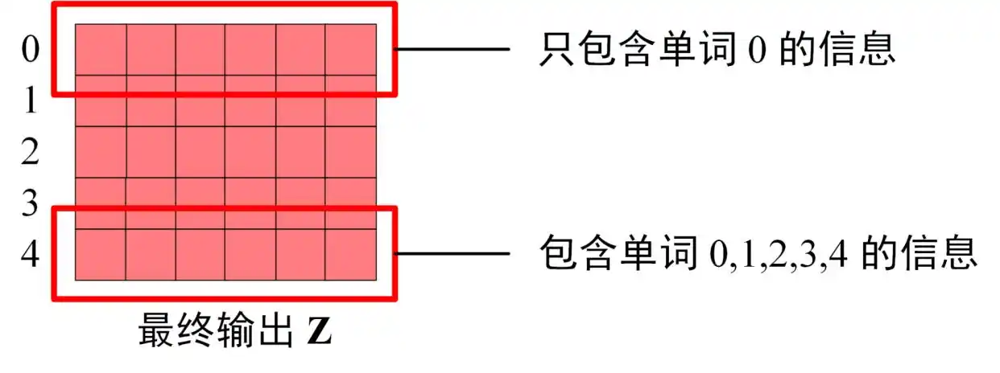
  <p>图18-Decoder输出Z</p>
</div>  

Softmax 根据输出矩阵的每一行预测下一个单词
<div align="center">
  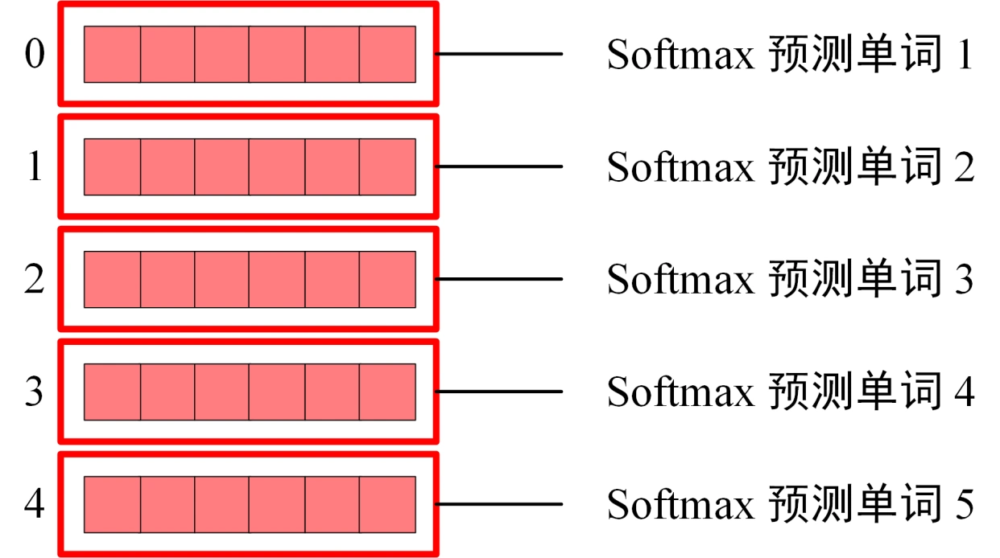
  <p>图19-Softmax单词预测</p>
</div>  


代码中过程如下：
```python
self.fc_output = nn.Linear(d_model,tgt_vocab_size)
self.softmax = nn.Softmax(dim=-1)  # 新增Softmax层
self.dropout = nn.Dropout(dropout)

decoder_out = self.decoder(tgt_emb, encoder_out, src_mask, tgt_mask)
logits = self.fc_output(decoder_out)

return self.softmax(logits)
```

---
## 6. Transformer总结

- 1️⃣ Transformer通过在输入中添加位置 Embedding，从而利用单词的顺序信息
- 2️⃣ Transformer 的重点是 Self-Attention 结构，其中不同Encoder，Decoder的各种Attention的 Q, K, V矩阵通过什么输出进行线性变换得到是掌握重点

Transformer代码：
```python
class Transformer(Module):
    def __init__(self,src_vocab_size, tgt_vocab_size, num_layers=6,
                 d_model=512, h=8, d_ff=2048, dropout=0.1):
        super().__init__()
        # 源与目标词语向量化
        self.encoder_embed = nn.Embedding(src_vocab_size, d_model)
        self.decoder_embed = nn.Embedding(tgt_vocab_size, d_model)

        self.positional_encoding = PositionalEncoding(d_model, dropout)
        self.encoder = Encoder(num_layers,d_model,h,d_ff,dropout)
        self.decoder = Decoder(num_layers,d_model,h,d_ff,dropout)

        self.fc_output = nn.Linear(d_model,tgt_vocab_size)
        self.softmax = nn.Softmax(dim=-1)  # 新增Softmax层
        self.dropout = nn.Dropout(dropout)

    def forward(self, src, tgt, src_mask=None, tgt_mask=None):
        # encoder
        src_emb = self.encoder_embed(src)
        src_emb = self.positional_encoding(src_emb)
        src_emb = self.dropout(src_emb)
        encoder_out = self.encoder(src_emb, src_mask)

        # decoder
        tgt_emb = self.decoder_embed(tgt)
        tgt_emb = self.positional_encoding(tgt_emb)
        tgt_emb = self.dropout(tgt_emb)
        decoder_out = self.decoder(tgt_emb, encoder_out, src_mask, tgt_mask)
        logits = self.fc_output(decoder_out)

        return self.softmax(logits)
```
---
# 完整代码
```python
import torch
from torch.nn import Module
from torch import nn
import math
import torch.nn.functional as F

'''位置信息编码模块：为输入序列添加位置信息'''
class PositionalEncoding(Module):
    """d_model: 词嵌入维度（也就是序列每个单元需要多少维度表示），max_len: 支持的最大序列长度"""
    def __init__(self, d_model, dropout=0.1, max_len=5000):
        # 继承torch.nn.Modlue类的基础方法
        # torch.nn.Modlue类： PyTorch 中所有神经网络模块的基类，
        # 所有神经网络组件（比如层、参数、计算步骤）都是它或它的子类
        super().__init__()

        # pe:编码矩阵初始化
        pe = torch.zeros(max_len, d_model)

        # 生成位置索引position.shape(max_len,1)
        position = torch.arange(0, max_len, dtype=torch.float).unsqueeze(1)
        # 计算频率项
        div_term = torch.exp(
            torch.arange(0,d_model,2,dtype=torch.float)
            *(math.log(10000)/-d_model))
        # 偶数位置索引
        pe[:,::2] = torch.sin(position*div_term)
        # 奇数位置索引
        pe[:,1::2] = torch.cos(position*div_term)

        # 增加batch维度，便于训练pe.shape(1,max_len,d_model)
        pe = pe.unsqueeze(0)

        # 将位置编码矩阵注册为buffer（不会被训练，但会保存到模型参数中）
        # 该方法将张量注册为模块的缓冲区，使得张量成为模块的一部分，并在模块保存和加载时被处理。
        self.register_buffer('pe', pe)

    def forward(self, x):
        # x.shape(batch_size,seq_len,d_model)
        # pe只取前seq_len个，降低计算成本
        # self.pe[:, :x.size(1)].shape(1,seq_len,d_model)
        x = x + self.pe[:, :x.size(1)]
        return x

'''多头注意力机制'''
class MultiHeadAttention(Module):
    def __init__(self, d_model, h, dropout=0.1):
        # d_model：输入的维度，h:注意力头数量
        super().__init__()
        # 断言d_model能被h整除，否则报错
        assert d_model % h == 0 ,"d_model must be divisible by num_heads"
        # 将每个注意力头的维度均分:
        # 为了在保持计算效率的同时，让每个注意力头能够专注于学习不同的语义特征。
        # 减少了计算量和参数量，提高了模型的泛化能力和训练效率。
        # 若保持每个注意力头的维度与原始维度一致，在理论上可以提高模型的表达能力，
        # 但在实际应用中往往会导致计算资源的浪费和训练难度的增加。
        self.d_k = d_model//h
        self.h = h

        # 线性变换矩阵Q、K、V
        self.W_q = nn.Linear(d_model, d_model)
        self.W_k = nn.Linear(d_model, d_model)
        self.W_v = nn.Linear(d_model, d_model)
        self.W_o = nn.Linear(d_model, d_model)

        self.dropout = nn.Dropout(p=dropout)

    """线性变换层"""
    def linear_transform(self,x,linear_layer):
        return linear_layer(x)

    """将线性变换后的结果切分为多个头"""
    def split_head(self,x,batch_size):
        # x.shape(batch_size, seq_len, d_model)
        # to (batch_size, seq_len,h, d_model)
        # 因为h*d_k=d_model,所以-1直接将原来还剩的维度存到第二维度
        x = x.view(batch_size, -1, self.h, self.d_k)
        # 将h维度转换到第二维度，便于后续将x(q\k\v)分给不同注意力头
        x = x.permute(0, 2, 1, 3)# 等价于x.transpose(1,2)
        return x

    """计算缩放点积注意力(默认不mask)"""
    def scaled_dot_attn(self,q,k,v,mask=None):
        # q\k\v.shape (batch_size, h, seq_len, d_k)
        # mask.shape (batch_size, h, seq_len, seq_len)
        # q与k^T相乘后缩小sqrt(d_k)得到
        # 注意力分数矩阵(batch_size, h, seq_len, seq_len)
        attention_score = (q@k.transpose(-2, -1))/math.sqrt(self.d_k)

        # 掩码的应用
        if mask is not None:
            # mask==0，得到bool矩阵，True位置对应需要mask的，False位置对应不mask
            # attention_score进行mask：
            # bool矩阵中True 的位置值替换为 -1e9，False保持不变
            attention_score = attention_score.masked_fill(mask == 0, -1e9)

        # 注意力权重
        attention_weight = F.softmax(attention_score, dim=-1)
        attention_weight = self.dropout(attention_weight)

        # 输出(batch_size, h, seq_len, d_k)
        output = attention_weight @ v
        return output, attention_weight

    """合并多个头的输出"""
    def merge_head(self, x, batch_size):
        # from (batch_size, h, seq_len, d_k)
        # to (batch_size, seq_len, h, d_k)
        x = x.permute(0, 2, 1, 3)
        x = x.reshape(batch_size, -1, self.h*self.d_k)
        return x

    def forward(self, q, k, v, mask=None):
        batch_size = q.size(0)

        # Self-Attention 中，q、k、v 被设定为相同的值，即q=k=v=x。
        # 因此，在代码调用时，通常直接传入 x 作为这三个参数
        # Cross-Attention（如 Decoder 中）时，q、k、v 可能不同：
        # q 来自 Decoder 的当前输入（或上一层的输出）；
        # k 和 v 来自 Encoder 的输出

        # 对查询、键、值进行线性变换之后，直接分给为多个头
        q = self.linear_transform(q, self.W_q)
        q = self.split_head(q, batch_size)

        k = self.linear_transform(k, self.W_k)
        k = self.split_head(k, batch_size)

        v = self.linear_transform(v, self.W_v)
        v = self.split_head(v, batch_size)

        # 多头注意力的计算与合并
        output,attention_weight = self.scaled_dot_attn(q, k, v, mask)
        output = self.merge_head(output, batch_size)

        # 最终输出线性变换
        output = self.W_o(output)
        return output

'''FFN前馈神经网络'''
class FeedForward(Module):
    def __init__(self, d_model,d_ff=2048, dropout=0.1):
        super().__init__()
        # 两层：第一层扩展维度(非线性在激活函数实现)，第二层压缩回维度且组合第一层非线性
        self.linear1 = nn.Linear(d_model, d_ff)
        self.dropout = nn.Dropout(p=dropout)
        self.linear2 = nn.Linear(d_ff, d_model)
    """前向传播：Linear->ReLU->Dropout->Linear"""
    def forward(self, x):
        # (batch_size, seq_len, d_ff)
        x = self.linear1(x)
        # 非线性关系
        x = F.relu(x)
        x = self.dropout(x)
        # (batch_size, seq_len, d_ff)
        return self.linear2(x)

'''EncoderBlock/Layer：Multi-Head Attention + FeedForward,每层后ADD&Norm'''
class EncoderLayer(Module):
    def  __init__(self, d_model, h, d_ff, dropout=0.1):
        super().__init__()
        self.self_att = MultiHeadAttention(d_model,h,dropout)
        self.ffn = FeedForward(d_model,d_ff,dropout)
        self.norm1 = nn.LayerNorm(d_model)
        self.norm2 = nn.LayerNorm(d_model)
        self.dropout1 = nn.Dropout(dropout)
        self.dropout2 = nn.Dropout(dropout)

    def forward(self, x, mask=None):
        # 自注意力的残差连接
        # self.self_att(x, x, x, mask)会自动调用MultiHeadAttention类的
        # forward方法。在PyTorch中，当你定义一个nn.Module类的实例
        # 并对其进行函数调用（即使用()）时，它会自动调用该类的forward方法
        x = x + self.dropout1(self.self_att(x, x, x, mask))
        x = self.norm1(x)

        # FFN的残差连接
        x = x + self.dropout2(self.ffn(x))
        return self.norm2(x)

'''DecoderBlock：Masked Multi-Head Attention + Multi-Head Attention + FeedForward'''
class DecoderLayer(Module):
    def __init__(self, d_model,h,d_ff,dropout=0.1):
        super().__init__()
        self.self_att = MultiHeadAttention(d_model,h,dropout)
        self.cross_att = MultiHeadAttention(d_model,h,dropout)
        self.ffn = FeedForward(d_model,d_ff,dropout)

        self.norm1 = nn.LayerNorm(d_model)
        self.norm2 = nn.LayerNorm(d_model)
        self.norm3 = nn.LayerNorm(d_model)
        self.dropout1 = nn.Dropout(dropout)
        self.dropout2 = nn.Dropout(dropout)
        self.dropout3 = nn.Dropout(dropout)

    def forward(self, x, encoder_output, src_mask=None, tgt_mask=None):
        # 第一层：自注意力（目标序列掩码）
        """自注意力使用tgt_mask"""
        x = x + self.dropout1(self.self_att(x, x, x, tgt_mask))
        x = self.norm1(x)

        # 第二层：交叉注意力
        # 使用上一个DecoderBlock的输出或x(第一个DecoderBlock时)计算Q
        # 编码器的输出生成K与V，以及mask源序列的无效位置（如padding）
        """交叉注意力使用src_mask"""
        x = x + self.dropout2(self.cross_att(x, encoder_output, encoder_output, src_mask))
        x = self.norm2(x)

        # 第三层：前馈神经网络
        x = x + self.dropout3(self.ffn(x))
        return self.norm3(x)

'''EncoderBlock堆叠'''
class Encoder(Module):
    def __init__(self, num_layers,d_model,h,d_ff, dropout=0.1):
        super().__init__()
        # 创建num_layers个EncoderBlock
        self.layers = nn.ModuleList(
            [EncoderLayer(d_model,h,d_ff,dropout) for _ in range(num_layers)]
        )

    def forward(self, x, mask=None):
        for layer in self.layers:
            x = layer(x, mask)
        return x

'''DecoderBlock堆叠'''
class Decoder(Module):
    def __init__(self, num_layers,d_model,h,d_ff, dropout=0.1):
        super().__init__()
        # 创建num_layers个DecoderBlock
        self.layers = nn.ModuleList(
            [DecoderLayer(d_model, h, d_ff,dropout) for _ in range(num_layers)]
        )

    def forward(self, x, encoder_output, src_mask=None, tgt_mask=None):
        for layer in self.layers:
            x = layer(x, encoder_output, src_mask, tgt_mask)
        return x

class Transformer(Module):
    def __init__(self,src_vocab_size, tgt_vocab_size, num_layers=6,
                 d_model=512, h=8, d_ff=2048, dropout=0.1):
        super().__init__()
        # 源与目标词语向量化
        self.encoder_embed = nn.Embedding(src_vocab_size, d_model)
        self.decoder_embed = nn.Embedding(tgt_vocab_size, d_model)

        self.positional_encoding = PositionalEncoding(d_model, dropout)
        self.encoder = Encoder(num_layers,d_model,h,d_ff,dropout)
        self.decoder = Decoder(num_layers,d_model,h,d_ff,dropout)

        self.fc_output = nn.Linear(d_model,tgt_vocab_size)
        self.softmax = nn.Softmax(dim=-1)  # 新增Softmax层
        self.dropout = nn.Dropout(dropout)

    def forward(self, src, tgt, src_mask=None, tgt_mask=None):
        # encoder
        src_emb = self.encoder_embed(src)
        src_emb = self.positional_encoding(src_emb)
        src_emb = self.dropout(src_emb)
        encoder_out = self.encoder(src_emb, src_mask)

        # decoder
        tgt_emb = self.decoder_embed(tgt)
        tgt_emb = self.positional_encoding(tgt_emb)
        tgt_emb = self.dropout(tgt_emb)
        decoder_out = self.decoder(tgt_emb, encoder_out, src_mask, tgt_mask)
        logits = self.fc_output(decoder_out)

        return self.softmax(logits)

def generate_mask(src,tgt,pad_idx=0):
    # 屏蔽padding部分
    ## 假设输入序列 src = [[1, 2, 0]]（pad_idx=0）
    ## src_mask = [[[[True, True, False]]]]  # 屏蔽第三个位置（填充）
    src_mask = (src != pad_idx).unsqueeze(1).unsqueeze(2) # (batch_size, 1, 1, src_len)

    # 屏蔽padding部分,假设目标序列 tgt = [[3, 4, 0]],pad_idx=0
    ## src_mask = [[[[True, True, False]]]]  # 屏蔽第三个位置（填充）
    tgt_mask = (tgt != pad_idx).unsqueeze(1).unsqueeze(2)
    # 上三角掩码
    # # triu_mask = [[[[True, False, False],
    #                 [True, True, False],
    #                 [True, True, True]]]]  # 未来信息掩码
    seq_len = tgt.size(1)
    # diagonal=0对角线为与上三角保留；1，不含对角线为的上三角保留
    # 然后1-原来的矩阵再反转
    trid_mask = (1-torch.triu(torch.ones(1,seq_len, seq_len), diagonal=1)).bool()
    # merged_tgt_mask = [[[[True, False, False],
    #                      [True, True, False],
    #                      [True, True, False]]]]  # 合并后的掩码
    tgt_mask = tgt_mask & trid_mask.to(tgt.device)

    return src_mask, tgt_mask

# 使用示例
if __name__ == "__main__":
    # 表示源语言和目标语言的词汇表各包含1000个唯一词元
    src_vocab_size = 1000
    tgt_vocab_size = 1000
    model = Transformer(src_vocab_size, tgt_vocab_size,
                        # num_layers=2编码器和解码器各包含2个堆叠的Transformer层
                        # d_model=128决定每个词元会被映射为128维向量\
                        # h=4多头注意力机制中分4个并行计算头，每个头的维度为d_model/h=32
                        num_layers=2,d_model=128, h=4,
                        # d_ff通常设置为4*d_model
                        # 在注意力计算和FFN层中随机丢弃10%的神经元，防止过拟合
                        d_ff=512, dropout=0.1)

    # 测试数据
    # 形状：(batch_size=10, src_seq_len=20)
    src = torch.randint(0, src_vocab_size, (10, 20))
    # 形状：(batch_size=10, src_seq_len=25)
    tgt = torch.randint(0, tgt_vocab_size, (10, 25))

    # 掩码
    src_mask, tgt_mask = generate_mask(src,tgt)

    output = model(src, tgt, src_mask, tgt_mask)
    print(output.size())
```
---
本文档是参照讲解教程学习后，自己编写的Transformer  
讲解教程: https://baijiahao.baidu.com/s?id=1651219987457222196&wfr=spider&for=pc  
github：https://github.com/lengbolengbo/transformer-self  
和鲸社区： https://www.heywhale.com/mw/project/67d82d3b7a5bc9d5e3872646?shareby=635791cb3f401e7af199f65e#  
CSDN：https://blog.csdn.net/lengbolengbo/article/details/146323821?fromshare=blogdetail&sharetype=blogdetail&sharerId=146323821&sharerefer=PC&sharesource=lengbolengbo&sharefrom=from_link